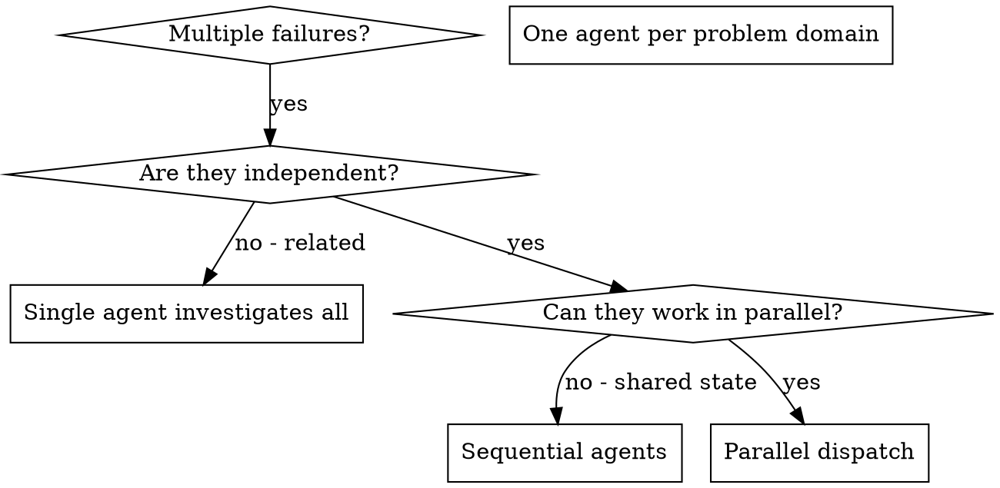

# Dispatching Parallel Agents

## Overview

You delegate read-only or non-owning investigation tasks to specialized agents with isolated context. Prefer bounded child packets over blindly forking full history, and only fork recent relevant history when a child genuinely needs the same thread context. Keep write ownership in the parent or the later implementation skill.

**Contract alignment:** Use this skill for read-only or non-owning parallel investigation. Do not use it for write-owning implementation of a plan; that belongs to `subagent-driven-development` or `executing-plans`.

**Contract references:** Follow `../../contract/process-family.md`, `../../contract/prompt-packet.md`, and `../../contract/package-standards.md` for ownership, packet shape, and package structure.

**Core principle:** Dispatch one explorer per independent problem domain. Let them investigate concurrently and return evidence, root cause, and recommended next steps.

**Dispatch rule:** Use `spawn_agent(task_name=..., agent_type="explorer", message="...")` for investigation-only work. Render the read-only investigation prompt into the packet format from `../../contract/prompt-packet.md` before dispatch. While children run, keep doing non-overlapping coordination work. If the next step depends on a child result, use blocked waits with `wait_agent(...)` instead of short polling.

## When to Use



**Use when:**
- Multiple failures or questions appear independent and need root-cause investigation
- You need read-only evidence from different subsystems at the same time
- Each domain can be understood without shared write ownership
- You want summaries that guide the next owner without mixing contexts

**Don't use when:**
- Failures are related (fix one might fix others)
- Need to understand full system state before decomposing
- The task is already write-owning implementation work
- Agents would interfere with each other or need to edit the same surface

## The Pattern

### 1. Identify Independent Domains

Group failures by what's broken:
- File A tests: Tool approval flow
- File B tests: Batch completion behavior
- File C tests: Abort functionality

Each domain is independent enough for read-only investigation to proceed in parallel.

### 2. Create Focused Agent Tasks

Each agent gets:
- **Specific scope:** One test file or subsystem
- **Clear goal:** Determine what is happening and why
- **Constraints:** Read-only only; no code ownership and no edits
- **Expected output:** Summary of evidence, likely root cause, affected files, and recommended next step

### 3. Dispatch in Parallel

```text
spawn_agent(task_name="abort_investigation", agent_type="explorer", message="[rendered packet text for the abort investigation]")
spawn_agent(task_name="batch_completion_investigation", agent_type="explorer", message="[rendered packet text for the batch completion investigation]")
spawn_agent(task_name="tool_approval_investigation", agent_type="explorer", message="[rendered packet text for the tool approval investigation]")
# All three run concurrently; keep coordinating locally until blocked on one of them
```

### 4. Synthesize and Route Next Work

When agents return:
- Read each summary
- Use `wait_agent({"timeout_ms": 180000})` only when blocked on a child result; use `300000` for heavier investigation streams
- Verify the domains are still independent and that the evidence is actionable
- Route write-owning follow-up to `subagent-driven-development` or `executing-plans`

## Agent Prompt Structure

Good agent prompts are:
1. **Focused** - One clear problem domain
2. **Self-contained** - All context needed to understand the problem
3. **Specific about output** - What should the agent return?
4. **Explicitly read-only** - No edits, no ownership claims

```markdown
Investigate the 3 failing tests in src/agents/agent-tool-abort.test.ts in read-only mode:

1. "should abort tool with partial output capture" - expects 'interrupted at' in message
2. "should handle mixed completed and aborted tools" - fast tool aborted instead of completed
3. "should properly track pendingToolCount" - expects 3 results but gets 0

These look like timing or state-tracking issues. Your task:

1. Read the test file and understand what each test verifies
2. Identify the most likely root cause - timing issue, state bug, or bad expectation
3. Inspect the related implementation and note the exact files/functions involved
4. Do NOT edit files or claim ownership of the fix

Do NOT stop at vague hypotheses. Point to the evidence.

Return: Summary of what you found, the likely root cause, and the recommended next step.
```

## Common Mistakes

**❌ Too broad:** "Handle all debugging" - agent gets lost
**✅ Specific:** "Investigate agent-tool-abort.test.ts" - focused scope

**❌ No context:** "Fix the race condition" - agent doesn't know where
**✅ Context:** Paste the error messages and test names

**❌ No constraints:** Agent might drift into write-owning work
**✅ Constraints:** "Read-only only. Do not edit files."

**❌ Vague output:** "See what you can find" - unusable result
**✅ Specific:** "Return evidence, root cause, affected files, and next step"

## When NOT to Use

**Related failures:** Fixing one might fix others - investigate together first
**Need full context:** Understanding requires seeing entire system
**Write-owning work:** A plan is already approved and someone needs to implement it
**Shared state:** Agents would interfere (editing same files, using same resources)

## Real Example from Session

**Scenario:** 6 test failures across 3 files after major refactoring

**Failures:**
- agent-tool-abort.test.ts: 3 failures (timing issues)
- batch-completion-behavior.test.ts: 2 failures (tools not executing)
- tool-approval-race-conditions.test.ts: 1 failure (execution count = 0)

**Decision:** Independent domains - abort logic separate from batch completion separate from race conditions

**Dispatch:**
```
Agent 1 → Investigate agent-tool-abort.test.ts
Agent 2 → Investigate batch-completion-behavior.test.ts
Agent 3 → Investigate tool-approval-race-conditions.test.ts
```

**Results:**
- Agent 1: Reported a race between abort state and partial-output capture
- Agent 2: Reported an event-shape mismatch in the completion path
- Agent 3: Reported missing synchronization before execution-count assertions

**Next step:** Hand the three write-owning fixes to the correct implementation workflow

**Time saved:** 3 investigations completed in parallel instead of sequentially

## Key Benefits

1. **Parallelization** - Multiple investigations happen simultaneously
2. **Focus** - Each agent has narrow scope, less context to track
3. **Independence** - Agents don't interfere with each other
4. **Speed** - 3 root-cause reports arrive in time of 1

## Verification

After agents return:
1. **Review each summary** - Understand what changed
2. **Check evidence quality** - Is the root cause tied to real files and behavior?
3. **Choose the next owner** - Keep read-only work separate from write-owning work
4. **Spot check** - Investigations can still miss a dependency

## Real-World Impact

From debugging session (2025-10-03):
- 6 failures across 3 files
- 3 agents dispatched in parallel
- All investigations completed concurrently
- The parent retained write ownership for follow-up changes
- Zero conflicts between child investigations
