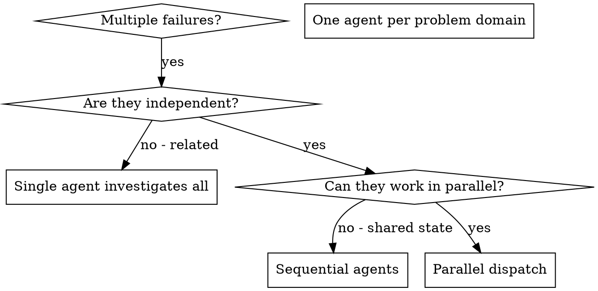

# Dispatching Parallel Agents

## Overview

You delegate tasks to specialized agents with isolated context. By precisely crafting their instructions and context, you ensure they stay focused and succeed at their task. Prefer bounded child context over blindly forking full history, and use `fork_turns="all"` only when the child genuinely needs the same working context. This also preserves your own context for coordination work.

When you have multiple unrelated failures (different test files, different subsystems, different bugs), investigating them sequentially wastes time. Each investigation is independent and can happen in parallel.

**Core principle:** Dispatch one agent per independent problem domain. Let them work concurrently.

**Codex v2 translation:** Use `spawn_agent(task_name=..., agent_type="parallel_explorer", message="...")` for the default read-only fanout lane. Keep follow-up coordination in the parent, use one long `wait_agent` only when blocked on a child, and reserve write-capable child roles for explicitly approved non-overlapping implementation slices.

## When to Use



**Use when:**
- 2+ test files failing with different root causes
- Multiple subsystems broken independently
- Each problem can be understood without context from others
- No shared state between investigations

**Don't use when:**
- Failures are related (fix one might fix others)
- Need to understand full system state
- Agents would interfere with each other

## The Pattern

### 1. Identify Independent Domains

Group failures by what's broken:
- File A tests: Tool approval flow
- File B tests: Batch completion behavior
- File C tests: Abort functionality

Each domain is independent - investigating tool approval doesn't require the abort lane.

### 2. Create Focused Agent Tasks

Each agent gets:
- **Specific scope:** One test file or subsystem
- **Clear goal:** Map one root cause precisely
- **Constraints:** Stay read-only unless the parent later approves a non-overlapping write slice
- **Expected output:** Summary of the root cause, evidence, and file references

### 3. Dispatch in Parallel

```text
spawn_agent(task_name="map_abort_failures", agent_type="parallel_explorer", message="Read src/agents/agent-tool-abort.test.ts and explain the root cause of the failing cases. Stay read-only and return file references.")
spawn_agent(task_name="map_batch_completion", agent_type="parallel_explorer", message="Read batch-completion-behavior.test.ts and summarize the failing-path root cause with evidence. Stay read-only.")
spawn_agent(task_name="map_tool_approval_race", agent_type="parallel_explorer", message="Investigate tool-approval-race-conditions.test.ts, identify the root cause, and return evidence. Stay read-only.")
# All three run concurrently; the parent keeps synthesis and decides whether implementation is needed later
```

### 4. Review and Integrate

When agents return:
- Read each summary
- Use `wait_agent` only when blocked on a specific child, then prefer the canonical `task_name` for any follow-up
- Synthesize the root-cause map in the parent
- Decide whether implementation is needed later
- If implementation is later approved, keep write-capable work on explicitly non-overlapping slices

## Agent Prompt Structure

Good agent prompts are:
1. **Focused** - One clear problem domain
2. **Self-contained** - All context needed to understand the problem
3. **Specific about output** - What should the agent return?

```markdown
Investigate the 3 failing tests in src/agents/agent-tool-abort.test.ts:

1. "should abort tool with partial output capture" - expects 'interrupted at' in message
2. "should handle mixed completed and aborted tools" - fast tool aborted instead of completed
3. "should properly track pendingToolCount" - expects 3 results but gets 0

These failures need investigation. Your task:

1. Read the test file and understand what each test verifies
2. Identify the root cause - timing issue, production bug, or expectation mismatch?
3. Trace the most relevant code paths and cite file references as evidence
4. Note the most likely next implementation target without changing files

Stay read-only. Do NOT just say "race condition" - tie it to concrete evidence.

Return: Summary of the root cause, evidence, and the file references the parent can use to decide whether implementation is needed later.
```

## Common Mistakes

**❌ Too broad:** "Fix all the tests" - agent gets lost
**✅ Specific:** "Investigate agent-tool-abort.test.ts and return the root cause with evidence" - focused scope

**❌ No context:** "Fix the race condition" - agent doesn't know where
**✅ Context:** Paste the error messages and test names so the child can map the root cause

**❌ No constraints:** Agent might refactor everything
**✅ Constraints:** "Stay read-only; do not change files unless I later assign a non-overlapping implementation slice"

**❌ Vague output:** "Fix it" - you don't know what changed
**✅ Specific:** "Return summary of the root cause, evidence, and likely next implementation target"

## When NOT to Use

**Related failures:** Fixing one might fix others - investigate together first
**Need full context:** Understanding requires seeing entire system
**Exploratory debugging:** You don't know what's broken yet
**Shared state:** Agents would interfere (editing same files, using same resources)
**Overlapping implementation:** If two children would edit the same files or shared state, do not use this skill as the execution lane. Go back to the controller-first plan flow instead.

## Real Example from Session

**Scenario:** 6 test failures across 3 files after major refactoring

**Failures:**
- agent-tool-abort.test.ts: 3 failures (timing issues)
- batch-completion-behavior.test.ts: 2 failures (tools not executing)
- tool-approval-race-conditions.test.ts: 1 failure (execution count = 0)

**Decision:** Independent domains - abort logic separate from batch completion separate from race conditions

**Dispatch:**
```
Agent 1 → Map root cause in agent-tool-abort.test.ts
Agent 2 → Map root cause in batch-completion-behavior.test.ts
Agent 3 → Map root cause in tool-approval-race-conditions.test.ts
```

**Results:**
- Agent 1: Identified an event-ordering gap with evidence in the abort path
- Agent 2: Identified an event structure mismatch with evidence in the batch-completion flow
- Agent 3: Identified missing async completion coordination with evidence in the race-condition path

**Integration:** Parent kept synthesis, combined the three read-only investigations, and then decided whether implementation was needed as a separate step

**Time saved:** 3 problem domains mapped in parallel vs sequentially

## Key Benefits

1. **Parallelization** - Multiple investigations happen simultaneously
2. **Focus** - Each agent has narrow scope, less context to track
3. **Independence** - Agents don't interfere with each other
4. **Speed** - 3 problem domains mapped in time of 1

## Verification

After agents return:
1. **Review each summary** - Understand the root cause and evidence
2. **Check for overlap** - If implementation is needed later, confirm any write-capable slices are non-overlapping
3. **Parent keeps synthesis** - Decide whether implementation is needed later
4. **Run verification after implementation** - Verify the approved follow-up work actually resolves the issue

## Real-World Impact

From debugging session (2025-10-03):
- 6 failures across 3 files
- 3 agents dispatched in parallel
- All investigations completed concurrently
- Parent kept synthesis and used the root-cause map to choose the next implementation step
- Zero overlap in the investigation slices
